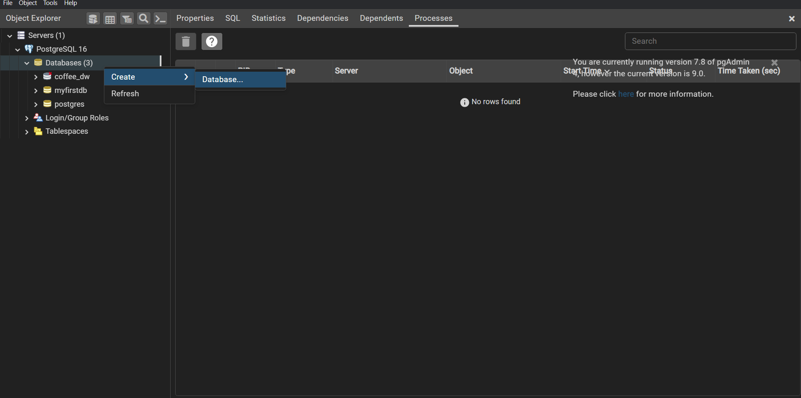
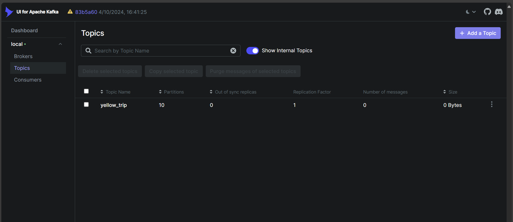
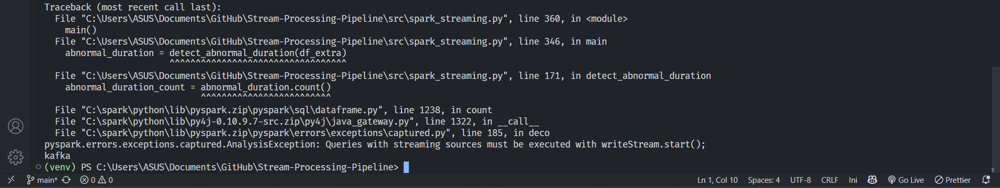

# ***New York City Yellow Trip Stream Processing***

This reference architecture shows an ***end-to-end real-time analytics pipeline*** utilizing ETL (Extract, Transform, Load) processes. The pipeline will ingest data from a source, perform necessary transformations and computations, and load it into storage for future purposes.

***Scenario***: A taxi company that has collected yellow taxi trip data in New York City. The dataset includes several fields such as total_amount, dropoff_location, pickup_location, and trip_distance. There is also a lookup file containing boroughs and zones based on location_id. To analyze trip trends in real-time, the company aims to calculate the number of trips, average revenue per hour,... and detect abnormal trips as early as possible.

## **Overview**

The following is the structure of the data pipeline:


## **Achievements**
- Detects abnormal trip durations (e.g., less than 1 minute, more than 2 hours) and identifies discrepancies between the actual and calculated amounts.
- Calculates average revenue and trip counts per hour, categorized by payment type and borough.
- Configures Spark session with optimized parameters, including custom shuffle partitions and broadcast joins for efficient processing.
- Provides a dynamic dashboard for monitoring and analyzing trends each day.
- Efficiently writes large-scale processed streaming data to PostgreSQL in near real-time.

{: style='width: 100%'}

## **📕 Table Of Contents**
* [⚙️ Local Setup](#local-setup)
* [💻 Deployment](#deployment)
    - [Postgres Setup](#postgres-setup)
    - [Kafka Setup](#kafka-setup)
    - [Spark Setup](#spark-setup)
* [Summary](#summary)

The sequence to run the script is: `create_table.py` -> `spark_streaming.py` -> `kafka_stream.py`

## **⚙️ Local Setup**

### **Dataset**
The company has shared with you 3 key datasets for this data.

??? "🚕 New York Yellow Taxi Dataset"
    The data file is too large to push it to GitHub. Therefore, please press below to download the zip file and extract it to the `data/` folder of the project directory. Otherwise, you can place it anywhere you want.

    <li><a href="https://drive.google.com/file/d/1mT3UTHNjPHGxKTQLuipTNqGLAsXInG9R/view" target="_blank">yellow_tripdata_2024.csv</a></li>

    | Field                | Description                                                                                                            |
    |----------------------|------------------------------------------------------------------------------------------------------------------------|
    | VendorID             | A code indicating the TPEP provider that provided the record. 1= Creative Mobile Technologies, LLC; 2= VeriFone Inc.    |
    | tpep_pickup_datetime  | The date and time when the meter was engaged.                                                                         |
    | tpep_dropoff_datetime | The date and time when the meter was disengaged.                                                                      |
    | Passenger_count       | The number of passengers in the vehicle. This is a driver-entered value.                                              |
    | Trip_distance         | The elapsed trip distance in miles reported by the taximeter.                                                         |
    | PULocationID          | TLC Taxi Zone in which the taximeter was engaged.                                                                     |
    | DOLocationID          | TLC Taxi Zone in which the taximeter was disengaged.                                                                  |
    | RateCodeID            | The final rate code in effect at the end of the trip.<br>1= Standard rate <br>2= JFK <br>3= Newark <br>4= Nassau or Westchester <br>5= Negotiated fare <br>6= Group ride |
    | Store_and_fwd_flag    | Indicates whether the trip record was held in vehicle memory before sending to the vendor due to no server connection.<br>Y = Store and forward trip <br>N = Not a store and forward trip |
    | Payment_type          | A numeric code signifying how the passenger paid for the trip.<br>1= Credit card <br>2= Cash <br>3= No charge <br>4= Dispute <br>5= Unknown <br>6= Voided trip |
    | Fare_amount           | The time-and-distance fare calculated by the meter.                                                                  |
    | Extra                 | Miscellaneous extras and surcharges, including $0.50 and $1 rush hour and overnight charges.                          |
    | MTA_tax               | $0.50 MTA tax automatically triggered based on the metered rate in use.                                               |
    | Improvement_surcharge | $0.30 improvement surcharge assessed at flag drop. This began in 2015.                                                |
    | Tip_amount            | Tip amount. Automatically populated for credit card tips; cash tips are not included.                                 |
    | Tolls_amount          | Total amount of all tolls paid in trip.                                                                               |
    | Total_amount          | The total amount charged to passengers. Does not include cash tips.                                                   |
    | Congestion_Surcharge  | Total amount collected in trip for NYS congestion surcharge.                                                          |
    | Airport_fee           | $1.25 for pick up only at LaGuardia and John F. Kennedy Airports.                                                     |


??? "🔍 Taxi Zone Lookup Table"
    This data is used to support the development of dashboard analyses in Power BI.**
    <li><a href="https://github.com/lnynhi02/Stream-Processing-Pipeline/blob/main/data/taxi_zone_lookup.csv" target="_blank">taxi_zone_lookup</a></li>

??? "🗺️ Taxi Zone Shapefile"
    This data is used to support the development of dashboard analyses in Power BI.
    <li><a href="https://github.com/lnynhi02/Stream-Processing-Pipeline/tree/main/data/taxi_zones" target="_blank">taxi_zone_shapefile</a></li>


### **Prerequisites**
<ul>
  <li>Install <a href="https://www.docker.com/products/docker-desktop/" target="_blank">Docker</a> for running Kafka</li>
  <li>Install <a href="https://www.oracle.com/java/technologies/downloads/?er=221886" target="_blank">JDK</a></li>
  <li>Install <a href="https://spark.apache.org/downloads.html" target="_blank">Spark</a></li>
  <li>Install <a href="https://www.python.org/" target="_blank">Python</a></li>
  <li>Install <a href="https://www.postgresql.org/download/" target="_blank">PostgreSQL</a></li>
</ul>

> **Apache Spark is only compatible with Java 8, Java 11, or Java 17.**

```bash
# Clone the repository
 git clone https://github.com/lnynhi02/Data-Pipeline-Project.git
```

**Here is the overall structure of the project:**

```
Project Directory
|
├── data
│   ├── yellow_tripdata_2024.csv
│   ├── taxi_zone_lookup.csv
│   └── taxi_zone_shapefile
|
├── config
│   ├── config.ini          # includes the configuration of PostgreSQL, Kafka, and email alerts
│   ├── index.txt           # the number of messages sent
│   └── requirements.txt
|
├── src
│   ├── utils.py            # contains helper functions, such as sending email alerts
│   ├── kafka_stream.py     # streams data from Kafka topic
│   └── spark_streaming.py  # processes streamed data using Spark Streaming
|
├── tmp
│   ├── sql_warehouse
│   ├── local_dir
│   └── checkpoint          # Spark Streaming checkpoints
│       ├── full_table_data
│       ├── abnormal_fee
│       ├── abnormal_duration
│       ├── avg_revenue_per_hour
│       ├── trip_count_per_hour
│       └── trip_count_by_borough
|
└── docker-compose.yaml     # used to run Kafka and Kafka UI services
```

## **💻 Deployment**
### Execution Overview 🎬
Before setting up the environment, here’s a quick demo of the pipeline in action:
📽️

{: style='width: 100%'}


### Postgres Setup
Before setting up our Spark and Airflow configurations, let’s create the Postgres database that will persist our data. I prefer using the **pgAdmin 4** tool for this; however, any other Postgres development platform can do the job.

When installing Postgres, you need to set up a password that we will need later to connect to the database from the Spark environment. **You must remember the password to reconnect to the database servers.** You can also leave the port at 5432.

You can create your database for the project in the pgAdmin4 or run the PostgreSQL script to create the database:




### Kafka Setup
To avoid resending messages that have already been processed each time we run the streaming task, we define an `index.txt` file that records the number of messages sent in the latest streaming session.

The code for the Kafka streaming task can be found in `src/kafka_stream.py`, which involves extracting data from a CSV file, serving the data to a Kafka topic using a Kafka producer, and updating the numbers in `index.txt`.

Run the Kafka service defined in the `docker-compose.yaml` file:

```
docker-compose up -d
```

After the services start, visit the Kafka UI at http://localhost:8800/:


Create a topic named *yellow_tripdata* with:

- *Replication factor* set to 1
- *Partitions* set to 10
- *Data retention* set to a small number.

### Spark Setup
The goal of the Spark jobs is to consume the streaming data from the Kafka topic **yellow_tripdata** and then transfer it to the Postgres tables.

The complete code for the Spark jobs is in the `src/spark_streaming.py` file.

- Create the Spark Session:
```python
def create_sparksession() -> SparkSession:
    spark = SparkSession.builder \
            .appName("KafkaToPostgres") \
            .config("spark.sql.shuffle.partitions", "9") \
            .config("spark.sql.warehouse.dir", "tmp/sql_warehouse") \
            .config("spark.local.dir", "tmp/local_dir") \
            .getOrCreate()
    return spark
```

- Read Kafka stream and apply schema:
```python
def create_schema(streaming_df):
    schema = StructType([
        StructField('VendorID', StringType(), True),
        StructField('tpep_pickup_datetime', StringType(), True),
        StructField('tpep_dropoff_datetime', StringType(), True),
        StructField('passenger_count', StringType(), True),
        StructField('trip_distance', StringType(), True),
        StructField('RatecodeID', StringType(), True),
        StructField('store_and_fwd_flag', StringType(), True),
        StructField('PULocationID', StringType(), True),
        StructField('DOLocationID', StringType(), True),
        StructField('payment_type', StringType(), True),
        StructField('fare_amount', StringType(), True),
        StructField('extra', StringType(), True),
        StructField('mta_tax', StringType(), True),
        StructField('tip_amount', StringType(), True),
        StructField('tolls_amount', StringType(), True),
        StructField('improvement_surcharge', StringType(), True),
        StructField('total_amount', StringType(), True),
        StructField('congestion_surcharge', StringType(), True),
        StructField('Airport_fee', StringType(), True)
    ])
    df = streaming_df.selectExpr("CAST(value AS String)")\
        .select(from_json(col('value'), schema).alias('data'))\
        .select('data.*')
    return df
```

- In the previous version of the pipeline, I didn't change the column types at the beginning. However, for this version, I've changed the data types upfront, so we no longer need to cast the data types during real-time analysis.
```python
def column_types(df_stream):
    df = df_stream.select(
        when(col("VendorID") == "", None).otherwise(col("VendorID").cast("int")).alias("vendor_id"),
        when(col("tpep_pickup_datetime") == "", None).otherwise(to_timestamp(col("tpep_pickup_datetime"))).alias("pickup_datetime"),
        when(col("tpep_dropoff_datetime") == "", None).otherwise(to_timestamp(col("tpep_dropoff_datetime"))).alias("dropoff_datetime"),
        when(col("passenger_count") == "", None).otherwise(col("passenger_count").cast("int")).alias("passenger_count"),
        when(col("trip_distance") == "", None).otherwise(col("trip_distance").cast("double")).alias("trip_distance"),
        when(col("RatecodeID") == "", None).otherwise(col("RatecodeID").cast("int")).alias("ratecode_id"),
        when(col("PULocationID") == "", None).otherwise(col("PULocationID").cast("int")).alias("pu_location_id"),
        when(col("DOLocationID") == "", None).otherwise(col("DOLocationID").cast("int")).alias("do_location_id"),
        when(col("payment_type") == "", None).otherwise(col("payment_type").cast("int")).alias("payment_type"),
        when(col("fare_amount") == "", None).otherwise(col("fare_amount").cast("double")).alias("fare_amount"),
        when(col("extra") == "", None).otherwise(col("extra").cast("double")).alias("extra"),
        when(col("mta_tax") == "", None).otherwise(col("mta_tax").cast("double")).alias("mta_tax"),
        when(col("tip_amount") == "", None).otherwise(col("tip_amount").cast("double")).alias("tip_amount"),
        when(col("tolls_amount") == "", None).otherwise(col("tolls_amount").cast("double")).alias("tolls_amount"),
        when(col("improvement_surcharge") == "", None).otherwise(col("improvement_surcharge").cast("double")).alias("improvement_surcharge"),
        when(col("total_amount") == "", None).otherwise(col("total_amount").cast("double")).alias("total_amount"),
        when(col("congestion_surcharge") == "", None).otherwise(col("congestion_surcharge").cast("double")).alias("congestion_surcharge"),
        when(col("Airport_fee") == "", None).otherwise(col("Airport_fee").cast("double")).alias("airport_fee")
    )
    df.printSchema()

    return df
```
- And by selecting only the columns needed for the analysis, we can improve performance and avoid scanning unnecessary columns, which helps reduce the read and write data volume.
```python
def select_column(df_parsed):
    df_main = df_parsed.select(
        "pickup_datetime", "dropoff_datetime", "total_amount", "payment_type"
    )

    df_extra = df_parsed.select(
        "pickup_datetime", "dropoff_datetime", "total_amount", "payment_type",
        "pu_location_id", "do_location_id", "fare_amount", "extra", "mta_tax", 
        "tip_amount", "tolls_amount", "improvement_surcharge", "airport_fee"
    )

    return df_main, df_extra
```
---
The following are some functions I use to analyze real-time data trends using **Spark Structured Streaming** and **Window functions**.

1. One of the functions is `detect_abnormal_fee` used to detect trips with abnormal fees, such as discrepancies between the total_amount and the calculated amount from summing individual fee components. Moreover, in this version, I’ve added an alert system that can immediately notify whenever an abnormal trip is detected.

    -  At first, I attempted to detect abnormal trip durations and add alert using the following code:
```python
def detect_abnormal_fee(df_extra):
    abnormal_fee = df_extra \
        .withColumn("caculated_total_amount", 
                    col("fare_amount") +
                    col("extra") +
                    col("mta_tax") +
                    col("tip_amount") +
                    col("tolls_amount") +
                    col("improvement_surcharge") +
                    col("airport_fee")) \
        .filter((abs(col("total_amount") - col("caculated_total_amount")) > 1) | (col("total_amount").isNull())) \
        .selectExpr(
            "pickup_datetime", 
            "dropoff_datetime", 
            "pu_location_id", 
            "do_location_id", 
            "round(abs(total_amount - caculated_total_amount), 2) AS amount_discrepancy"
        )
    
    # === Adding alert ===
    abnormal_fee_count = abnormal_fee.count()
    if abnormal_fee_count > 0:
        alert_message = f"⚠️ {abnormal_fee_count} trips with abnormal fee detected."

        send_email(
            subject="Alert: Abnormal Trip Fee Detected",
            body=alert_message,
            to_email=config["email"]["to_email"]
        )

        logging.warning(alert_message)
    
    query = abnormal_duration \
        .writeStream \
        .foreachBatch(process_abnormal_fee) \
        .outputMode("append") \
        .option("checkpointLocation", "tmp/checkpoint/abnormal_fee") \
        .start()
    
    return query
```
    - However, this approach caused a runtime error:

    --> This is because in Spark Structured Streaming, actions like `.count()` **cannot be directly applied on streaming DataFrames**, as the data flows continuously—unlike in batch processing where you can simply use `df.count()`. Instead, we need to process the data within a `foreachBatch` function, where each micro-batch is treated as a regular batch DataFrame. This enables us to safely use actions like .`count()` and apply custom logic.

    - The corrected implementation is as follows:
```python
def detect_abnormal_fee(df_extra):
    def process_abnormal_fee(batch_df, epoch_id):
        abnormal_fee = batch_df \
            .withColumn("caculated_total_amount", 
                        col("fare_amount") +
                        col("extra") +
                        col("mta_tax") +
                        col("tip_amount") +
                        col("tolls_amount") +
                        col("improvement_surcharge") +
                        col("airport_fee")) \
            .filter((abs(col("total_amount") - col("caculated_total_amount")) > 1) | (col("total_amount").isNull())) \
            .selectExpr(
                "pickup_datetime", 
                "dropoff_datetime", 
                "pu_location_id", 
                "do_location_id", 
                "round(abs(total_amount - caculated_total_amount), 2) AS amount_discrepancy"
            )
        
        # === Adding alert ===
        abnormal_fee_count = abnormal_fee.count()
        if abnormal_fee_count > 0:
            alert_message = f"⚠️ {abnormal_fee_count} trips with abnormal fee detected."

            send_email(
                subject="Alert: Abnormal Trip Fee Detected",
                body=alert_message,
                to_email=config["email"]["to_email"]
            )

            logging.warning(alert_message)

        foreach_batch_jdbc_writer(abnormal_fee, epoch_id, "abnormal_fee")

    
    query = df_extra \
        .writeStream \
        .foreachBatch(process_abnormal_fee) \
        .outputMode("append") \
        .option("checkpointLocation", "tmp/checkpoint/abnormal_fee") \
        .start()
    
    return query
```
---

2. The function `avg_revenue_per_hour` is used to calculate the average revenue per hour, grouped by *payment type*. By applying filters before performing aggregations, it reduces the amount of data shuffled across the cluster, resulting in lower computation time and improved efficiency.
```python
def avg_revenue_per_hour(df_main):    
    avg_revenue_per_hour = df_main \
        .filter(col("total_amount").isNotNull()) \
        .withWatermark("pickup_datetime", "60 minutes") \
        .groupBy(window(col("pickup_datetime"), "60 minutes")) \
        .agg(
            avg("total_amount").alias("total_amount"),
            avg(expr("CASE WHEN payment_type = 1 THEN total_amount END")).alias("credit_card"),
            avg(expr("CASE WHEN payment_type = 2 THEN total_amount END")).alias("cash")
        ) \
        .selectExpr(
            "cast(date_format(window.start, 'yyyy-MM-dd') as date) AS date",
            "date_format(window.start, 'HH:mm:ss') AS start_time",
            "date_format(window.end, 'HH:mm:ss') AS end_time",
            "round(total_amount, 2) AS total_amount",
            "round(credit_card, 2) AS credit_card",
            "round(cash, 2) AS cash"
        ) \
        .drop("window")
    
    query = avg_revenue_per_hour \
        .writeStream \
        .foreachBatch(lambda df, epoch_id: foreach_batch_jdbc_writer(df, epoch_id, "avg_revenue_per_hour")) \
        .outputMode("append") \
        .option("checkpointLocation", "tmp/checkpoint/avg_revenue") \
        .start()
    
    return query
```
---

3. The function `calculate_trip_count_per_zone` is used to count the number of trips per borough. We use the `ttaxi_zone_lookup.csv` file located in the `data/` folder as a reference for zone and borough mapping. To improve performance and avoid shuffling, a `broadcast join` is used—this is especially effective when joining a large dataset with a smaller one.
```python
def caculate_trip_count_per_zone(spark, df_extra):
    taxi_zone_lookup_path = ("data/taxi_zone_lookup.csv")

    lookup_df = spark.read.csv(taxi_zone_lookup_path, header=True, inferSchema=True)
    df_extra = df_extra \
    .select(
        "pickup_datetime", "dropoff_datetime", "pu_location_id"
    )

    df_extra_with_location = df_extra \
        .join(broadcast(lookup_df), df_extra.pu_location_id == lookup_df.LocationID, "left") \
        .select(df_extra["*"], lookup_df["LocationID"], lookup_df["Borough"])

    trip_count_per_borough = df_extra_with_location \
        .withWatermark("pickup_datetime", "60 minutes") \
        .groupBy(
            window(col("pickup_datetime"), "60 minutes"),
            "Borough"
        ) \
        .agg(count("pu_location_id").alias("total_trip")) \
        .selectExpr(
            "cast(date_format(window.start, 'yyyy-MM-dd') as date) AS date",
            "date_format(window.start, 'HH:mm:ss') AS start_time",
            "date_format(window.end, 'HH:mm:ss') AS end_time",
            "Borough AS borough",
            "total_trip"
        ) \
        .drop("window")

    query = trip_count_per_borough \
        .writeStream \
        .outputMode("append") \
        .foreachBatch(lambda df, epoch_id: foreach_batch_jdbc_writer(df, epoch_id, "trip_count_by_borough")) \
        .option("checkpointLocation", "tmp/checkpoint/trip_count_by_borough") \
        .start()

    return query
```
---

- Run Spark jobs:
```bash
$SPARK_HOME/bin/spark-class.cmd org.apache.spark.deploy.master.Master
$SPARK_HOME/sbin/start-master.sh
```

- Start a Spark worker:
```bash
$SPARK_HOME/bin/spark-class.cmd org.apache.spark.deploy.worker.Worker spark://HOST:PORT
$SPARK_HOME/sbin/start-slave.sh spark://HOST:PORT
```

- Submit Spark jobs:
```bash
$YOUR_PROJECT_DIRECTORY/spark-submit \
--master spark://HOST:PORT \
--num-executors 1 \
--executor-memory 5G \
--total-executor-cores 10 \
--packages org.apache.spark:spark-sql-kafka-0-10_2.12:3.5.1,org.postgresql:postgresql:42.5.4,org.apache.kafka:kafka-clients:3.7.0 \
--driver-class-path /path-to-your-jar/postgresql-x.x.x.jar \
src/spark_streaming.py
```

If there are no errors, you can then query the data in pgAdmin4. For a step-by-step tutorial, refer to the [Execution Overview 🎬](#execution-overview)

!!! note "Technical Notes"
    - **Using a Single Executor:** Due to limited CPU and memory resources, a **fat executor** approach is used—allocating all available resources to a **single executor**. With 10 cores, each core receives 500MB of memory, optimizing data processing efficiency.  Since each partition ideally handles around 250MB of data, this configuration ensures that each core can comfortably process a partition without running into memory constraints, maintaining optimal parallelism and performance.
    - **Kafka Partitioning Strategy:** Kafka topics are configured with *10 partitions* to align with Spark's 10 available cores, ensuring parallel processing and maximizing throughput.

## **Summary**
Throughout this guide, we’ve thoroughly examined each component of the pipeline, setting up Kafka for data streaming, from processing data with Spark to storing it in PostgreSQL. The incorporation of Docker simplifies the Kafka setup.

It's important to note that while this setup is ideal for learning and small-scale projects, scaling it for production use would require additional considerations, particularly regarding security and performance optimization. Future enhancements could include integrating advanced data processing techniques,expanding the pipeline to incorporate more complex data sources.

Thank you very much for following along with me. If you have any questions, feel free to inbox me. I hope you enjoy working on the project. Thank you!