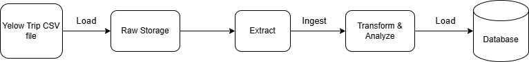
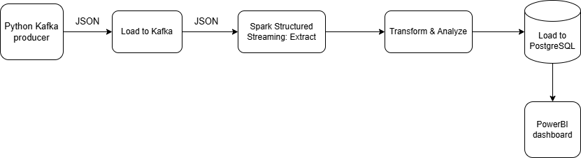

# ***📝 DOCUMENTATION***

## I. Design
**Note**: This is a simulated real-time analysis pipeline, intended purely for experimental and practice purposes.

### 1. Data Source
The data is divided into several CSV files and used as follows:

- `yellow_tripdata_2024.csv`: Contains taxi trips in New York City in 2024

| Field                | Description                                                                                                            |
|----------------------|------------------------------------------------------------------------------------------------------------------------|
| VendorID             | A code indicating the TPEP provider that provided the record. 1= Creative Mobile Technologies, LLC; 2= VeriFone Inc.    |
| tpep_pickup_datetime  | The date and time when the meter was engaged.                                                                         |
| tpep_dropoff_datetime | The date and time when the meter was disengaged.                                                                      |
| Passenger_count       | The number of passengers in the vehicle. This is a driver-entered value.                                              |
| Trip_distance         | The elapsed trip distance in miles reported by the taximeter.                                                         |
| PULocationID          | TLC Taxi Zone in which the taximeter was engaged.                                                                     |
| DOLocationID          | TLC Taxi Zone in which the taximeter was disengaged.                                                                  |
| RateCodeID            | The final rate code in effect at the end of the trip. 1= Standard rate  2= JFK  3= Newark  4= Nassau or Westchester  5= Negotiated fare  6= Group ride |
| Store_and_fwd_flag    | Indicates whether the trip record was held in vehicle memory before sending to the vendor due to no server connection. Y = Store and forward trip  N = Not a store and forward trip |
| Payment_type          | A numeric code signifying how the passenger paid for the trip. 1= Credit card  2= Cash  3= No charge  4= Dispute  5= Unknown  6= Voided trip |
| Fare_amount           | The time-and-distance fare calculated by the meter.                                                                  |
| Extra                 | Miscellaneous extras and surcharges, including $0.50 and $1 rush hour and overnight charges.                          |
| MTA_tax               | $0.50 MTA tax automatically triggered based on the metered rate in use.                                               |
| Improvement_surcharge | $0.30 improvement surcharge assessed at flag drop. This began in 2015.                                                |
| Tip_amount            | Tip amount. Automatically populated for credit card tips; cash tips are not included.                                 |
| Tolls_amount          | Total amount of all tolls paid in trip.                                                                               |
| Total_amount          | The total amount charged to passengers. Does not include cash tips.                                                   |
| Congestion_Surcharge  | Total amount collected in trip for NYS congestion surcharge.                                                          |
| Airport_fee           | $1.25 for pick up only at LaGuardia and John F. Kennedy Airports.                                                     |

- `taxi_zone_lookup.csv`: A list of boroughs and zones

    - LocationID: A unique identifier for each location.
    - Borough: The borough in New York City where the location belongs (e.g., Manhattan, Brooklyn, etc.)
    - Zone: The specific zone within the borough.

### 2. Business Requirements
1. Real-time analysis: Analyze trip data in real-time to monitor trends and insights.
    - Detect trips with abnormal fees and durations.
    - Track the number of trips and the distribution of trips by borough in real-time.
    - Identify the most preferred payment methods and calculate the average revenue per hour.

2. Weekly Analysis: Generate comprehensive reports to uncover patterns and support strategic decisions.
    - Store complete data for batch processing and deeper analysis.
    - Compare trends across different weekdays to identify behavior patterns.
    - Analyze weekly performance metrics such as total revenue, trip volume, and preferred payment types.

### 3. ETL Design

#### ETL Diagram

#### Task Flow

#### Tech Selection

- `Kafka`: Kafka: A distributed event streaming platform designed to handle real-time data and support high-throughput, parallel processing.
- `Spark`: A distributed data processing engine that works seamlessly with Kafka. With **Spark Structured Streaming**, it enables near real-time data processing and real-time analytics. Spark is highly scalable and capable of handling large-scale data workloads.
- `PostgreSQL`: While not the best choice for handling large-scale or high-frequency real-time data due to its limitations in continuous writing and scalability, it's used in this experimental project for simplicity. Additionally, PostgreSQL integrates well with Power BI, which is used here for visualization.
- `PowerBI`: Used to build dashboards and visualize insights. It easily connects to PostgreSQL, making it convenient to create daily or weekly reports with minimal setup.

## II. [Deployment](deployment.md)
